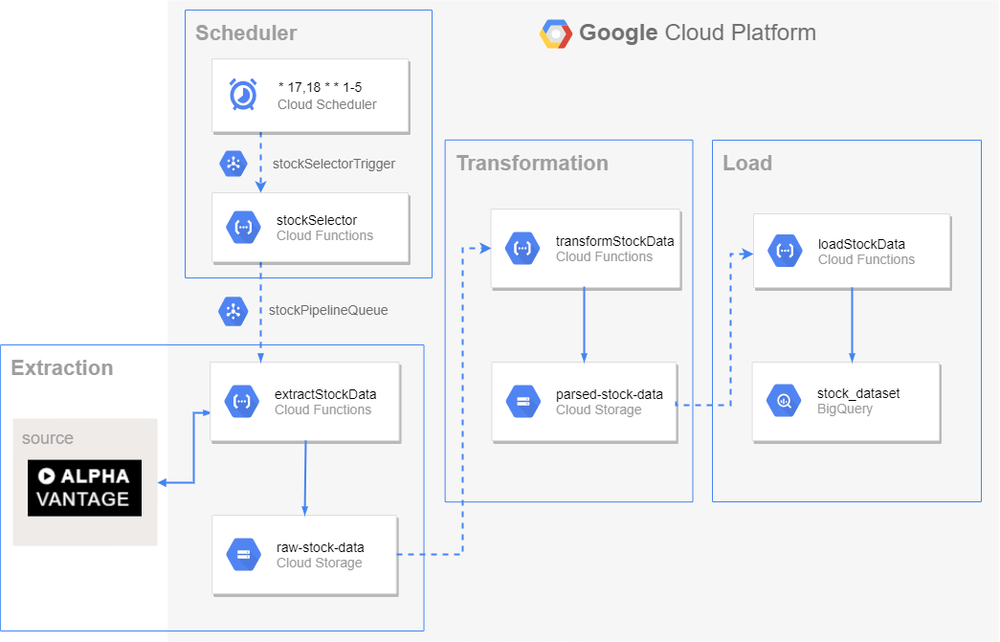

# Stock Prices ETL

A serverless ETL pipeline for loading stock prices from [Alpha Vantage](https://www.alphavantage.co/) into [Google BigQuery](https://cloud.google.com/bigquery/).



### Requirements

* conf/env.js file with the following content:
```javascript
module.exports = {
  API_KEY: "string"
}
```

* ~/.gcloud/keyfile.json as described [here](https://serverless.com/framework/docs/providers/google/guide/credentials/).

### Deploy

* Make sure that you have [node](https://nodejs.org/en/) installed and run the following commands:

```sh
npm install
npm run deploy
```

* Create a Cloud Scheduler job with the following expression: *\* 17,18 * * 1-5*, in *Eastern Daylight Time (EDT)*, that publishes a message in *stockSelectorTrigger*

* Throughout the pipeline execution, some extractions may fail because of the alphavantage API quota (5 requests per minute). To deal with this, you may also create an auxiliar Cloud Scheduler job
that will trigger the selector a few times after the first cloud scheduler job finished. This will assure that every stock is downloaded. *PS: if the selector runs and there is no remaining stocks to download, it will simply not trigger the pipeline*. 

### TO DO
* Update diagram with deduplication and dailyJobs
* Move dailyJobs to bigquery
* Improve logging with custom lib (winston maybe)
